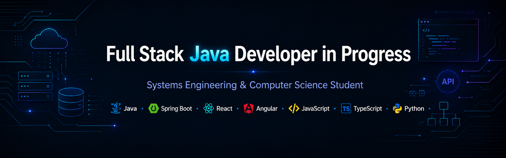

  

  

<h1 align="center">Olá, eu sou Cláudio Tavares 👋</h1>

<h3 align="center">
  Full Stack Java Developer in Progress | Systems Engineering Student
</h3>

---

## 👨‍💻 Sobre mim

Sou estudante de **Engenharia de Sistemas e Informática** e estou em transição para a área de **Desenvolvimento de Software**, com foco em me tornar **Desenvolvedor Full Stack Java**.

Atualmente atuo como **Agente de Segurança no Banco de Cabo Verde**, experiência que fortaleceu minha disciplina, responsabilidade, atenção aos detalhes, visão sobre segurança, organização e processos.

Meu objetivo é construir soluções modernas, seguras e escaláveis para a web.

---

## 🚀 Tecnologias em estudo

  

**Java • Spring Boot • Angular • React • JavaScript • TypeScript • Python • HTML • CSS • PHP**

---

## 🎯 Foco atual

- Aprender Java com profundidade
- Criar APIs REST com Spring Boot
- Desenvolver interfaces modernas com React e Angular
- Construir projetos reais para portfólio
- Evoluir para uma oportunidade como Desenvolvedor Full Stack Java

---

## 📌 Projetos em breve

- Sistema CRUD com Java e Spring Boot
- API REST com autenticação
- Dashboard web com React ou Angular
- Sistema completo com frontend, backend e banco de dados

---

## 📫 Contato

- LinkedIn: [linkedin.com/in/claudiojgtavares](https://www.linkedin.com/in/claudiojgtavares/)
- Email: [claudiogt1992@gmail.com](mailto:claudiogt1992@gmail.com)

---

  <strong>Construindo minha jornada como Desenvolvedor Full Stack Java 🚀</strong>

