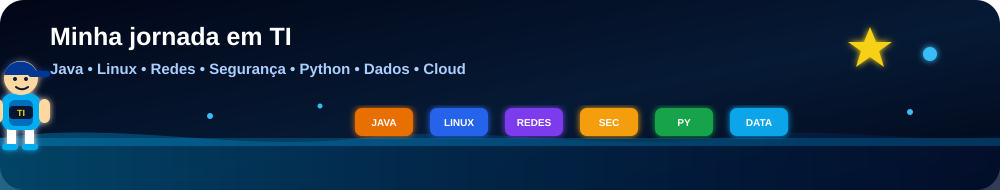

  

<h1 align="center">Olá, eu sou Cláudio Tavares 👋</h1>

  <strong>Estudante do 3.º ano de Engenharia de Sistemas e Informática</strong> 
  Profissional no Banco de Cabo Verde • Em transição para Tecnologias de Informação

  
  
  
  
  

---

## 👨‍💻 Sobre mim

Sou estudante do **3.º ano de Engenharia de Sistemas e Informática na Universidade Jean Piaget de Cabo Verde** e estou a construir uma transição profissional sólida para a área de **Tecnologias de Informação**.

Atualmente trabalho no **Banco de Cabo Verde** como **Agente de Segurança**, função que desempenho desde 2018. Essa experiência reforçou competências que levo comigo para a tecnologia: **disciplina, responsabilidade, atenção aos detalhes, confidencialidade, controlo de acessos e cumprimento rigoroso de procedimentos**.

Paralelamente, venho a desenvolver uma base técnica em **sistemas operativos, redes de computadores, Help Desk, Linux e segurança da informação**. Estou também a estudar **Java**, reforçando fundamentos de programação e desenvolvimento de software. Além disso, frequento o programa **Skodji Digital**, ainda em andamento, onde continuo a evoluir em áreas como **Linux e Segurança na Cloud, Business Intelligence, Inteligência Artificial, Engenharia de Software e Python para Dados**.

> O meu foco é simples: aprender, praticar e transformar conhecimento em projetos que possam ser demonstrados.

---

## 🧭 Onde estou agora

| Base que já venho construindo | Em desenvolvimento atualmente | Próximos passos |
|---|---|---|
| Sistemas Operativos | Java e fundamentos de programação | Projetos Java para portfólio |
| Redes de Computadores | Python para Dados | Projetos completos de portfólio |
| Help Desk | Business Intelligence | Cloud na prática |
| Linux / Ubuntu Server | Engenharia de Software | APIs e aplicações |
| Segurança da Informação | Inteligência Artificial | Dashboards e análise de dados |
| Git e GitHub | Documentação técnica | Integração entre software, dados e segurança |

---

## 🛠️ Tecnologias e áreas

  

  <strong>Java</strong> • <strong>Sistemas & Redes</strong> • <strong>Help Desk</strong> • <strong>Linux</strong> • <strong>Segurança</strong> • <strong>Python</strong> • <strong>Dados</strong> • <strong>Cloud</strong>

As tecnologias aparecem aqui à medida que são estudadas e utilizadas em atividades ou projetos reais. Java está atualmente em estudo e ganhará maior destaque à medida que os projetos forem publicados.

---

## 📌 Projeto em destaque

### 🐧 [Linux, Segurança e Cloud](https://github.com/claudiojgtavares/linux-seguranca-cloud)

Laboratório prático desenvolvido no contexto da formação **Skodji Digital**, utilizando **Ubuntu Server numa VM VMware**.

Neste repositório documento atividades relacionadas com:

- comandos Linux e organização do ambiente;
- utilizadores, grupos e permissões;
- princípio do menor privilégio;
- preparação para acesso remoto via SSH;
- conceitos de VM, VPS e infraestrutura cloud;
- evidências e documentação técnica da aprendizagem.

**Estado:** projeto em evolução conforme avanço na formação.

---

## 🚀 Próximos projetos de portfólio

Quero transformar a aprendizagem atual em projetos demonstráveis. Entre os próximos passos estão:

- um projeto em **Java** para consolidar lógica, orientação a objetos e organização de código;
- um projeto mais completo combinando **software, dados, cloud e segurança**;
- projetos desenvolvidos ao longo do **Skodji Digital**, conforme os módulos forem concluídos.

O GitHub será atualizado por etapas, mostrando não apenas o resultado final, mas também a evolução do projeto.

---

## 🎮 Minha jornada

  

---

## 🎯 Objetivo profissional

Construir uma carreira em **Tecnologias de Informação** com uma base técnica sólida e demonstrável. Tenho especial interesse em **sistemas e redes, suporte técnico, desenvolvimento de software, Java, dados, cloud e cibersegurança**.

Quero que este perfil seja uma prova da minha evolução: menos promessas, mais **projetos, documentação e resultados reais**.

---

## 🤝 Vamos conectar

  

  <strong>Disciplina • Aprendizagem • Evolução • Tecnologia</strong>

